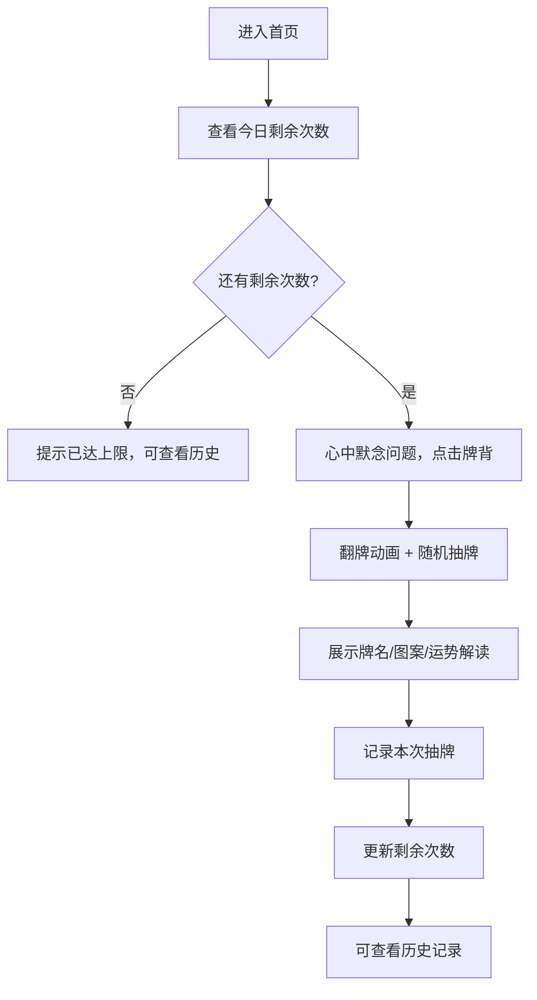

## 1. 产品概述

"今日运势占卜塔罗"是一款面向大众的轻量级占卜网页应用，用户通过点击塔罗牌背面，随机抽取一张塔罗牌，获取今日运势解读。产品以神秘、优雅的视觉风格，结合流畅的翻牌动画，为用户带来沉浸式的占卜体验。同时设置每日限抽3次的防沉迷机制，引导用户理性对待占卜结果。

- 主要用途：每日运势占卜、休闲娱乐、心理慰藉
- 目标用户：对塔罗牌感兴趣的年轻用户、寻求日常心理指引的人群
- 产品价值：提供有趣的占卜体验，结合历史记录帮助用户回顾运势轨迹

## 2. 核心功能

### 2.1 用户角色
| 角色 | 注册方式 | 核心权限 |
|------|----------|----------|
| 游客用户 | 无需注册 | 每日抽牌3次、查看历史记录 |

### 2.2 功能模块
1. **首页（抽牌页）**：塔罗牌展示区、抽牌按钮、今日剩余次数提示
2. **牌面解读页**：牌名、牌面图案、运势解读文本
3. **历史记录页**：抽牌历史列表、运势回顾统计

### 2.3 页面详情
| 页面名称 | 模块名称 | 功能描述 |
|---------|---------|----------|
| 首页 | 塔罗牌展示区 | 展示塔罗牌背面，点击触发翻牌动画和随机抽牌 |
| 首页 | 次数提示 | 显示今日剩余抽牌次数，已达上限时禁用抽牌 |
| 牌面解读 | 牌名展示 | 大字体展示抽取的塔罗牌名称 |
| 牌面解读 | 牌面图案 | 展示塔罗牌的主视觉图案 |
| 牌面解读 | 运势解读 | 展示今日运势的详细解读文字 |
| 历史记录 | 历史列表 | 按日期倒序展示过往抽牌记录 |
| 历史记录 | 运势回顾 | 统计各牌出现频率、整体运势趋势 |

## 3. 核心流程

用户进入首页，看到一张神秘的塔罗牌背面。心中默念问题后点击牌面，塔罗牌缓缓翻转并随机抽取一张。翻牌动画结束后展示牌名、图案和今日运势解读。系统记录本次抽牌，更新今日剩余次数。用户可切换到历史记录页面查看过往抽牌记录和运势统计。

## 4. 用户界面设计

### 4.1 设计风格
- **主色调**：深紫色（#2D1B69）搭配金色（#D4AF37）点缀，营造神秘占卜氛围
- **辅助色**：靛蓝色、紫罗兰色渐变
- **背景**：深色星空纹理背景，配合微妙的星云光晕
- **按钮风格**：圆角金色边框按钮，悬浮时有微光效果
- **字体**：标题使用衬线字体（Playfair Display），正文使用优雅无衬线字体
- **图标风格**：线性金色图标，与整体神秘风格统一
- **整体氛围**：神秘、优雅、具有仪式感

### 4.2 页面设计概览
| 页面名称 | 模块名称 | UI元素 |
|---------|---------|--------|
| 首页 | 塔罗牌区 | 居中大尺寸塔罗牌，背面有金色花纹浮雕，3D翻转效果 |
| 首页 | 提示文案 | "心中默念你的问题，点击牌面开启今日运势" |
| 首页 | 次数徽章 | 右上角显示今日剩余次数，金色圆形徽章 |
| 牌面解读 | 牌面展示 | 翻转动画后展示牌面图案，金色装饰边框 |
| 牌面解读 | 解读文字 | 卡片式布局，优雅的排版，分点展示运势 |
| 历史记录 | 时间线 | 纵向时间线布局，每天一条记录 |
| 历史记录 | 统计卡片 | 顶部展示抽牌总数、最常出现的牌 |

### 4.3 响应式
- 采用移动端优先设计，同时适配桌面端
- 塔罗牌尺寸根据屏幕宽度自适应
- 历史记录在移动端单列展示，桌面端双列网格
- 触摸设备优化点击区域和手势

### 4.4 动画与交互
- 塔罗牌翻转动画：CSS 3D transform，持续1.5秒，带缓动效果
- 牌面出现时的微光闪烁动画
- 按钮悬浮时的金色光晕扩散
- 页面切换时的淡入淡出过渡
- 抽牌前牌面的轻微呼吸浮动效果
