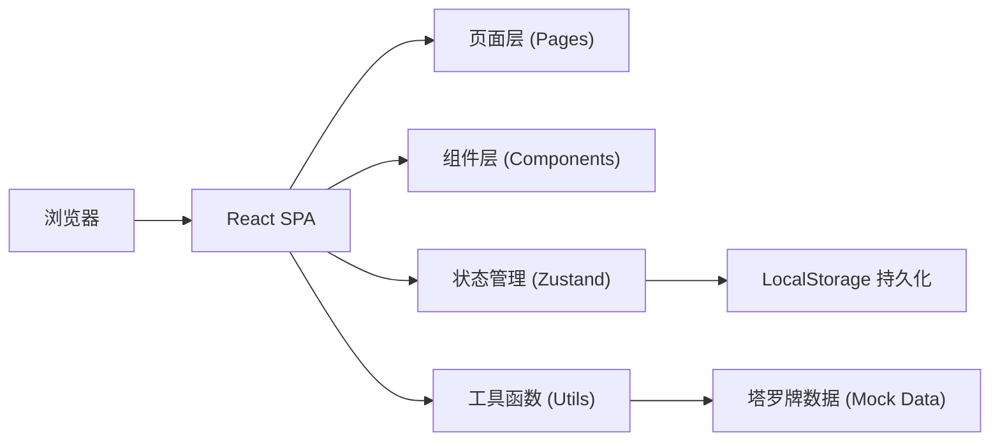

## 1. 架构设计

本项目为纯前端应用，数据存储使用浏览器 LocalStorage，无需后端服务。整体架构为单页应用（SPA），采用组件化开发模式。



## 2. 技术描述

- **前端框架**：React@18 + TypeScript
- **构建工具**：Vite@5
- **样式方案**：TailwindCSS@3
- **状态管理**：Zustand
- **路由管理**：React Router DOM@6
- **图标库**：Lucide React
- **数据存储**：浏览器 LocalStorage
- **初始化工具**：vite-init

## 3. 路由定义

| 路由 | 页面 | 用途 |
|------|------|------|
| / | 首页（抽牌页） | 展示塔罗牌背面，触发抽牌，展示结果 |
| /history | 历史记录页 | 展示抽牌历史和运势统计 |

## 4. 数据模型

### 4.1 塔罗牌数据结构

```typescript
interface TarotCard {
  id: number;
  name: string;
  nameEn: string;
  image: string;
  meaning: string;
  loveFortune: string;
  careerFortune: string;
  wealthFortune: string;
  healthFortune: string;
}
```

### 4.2 抽牌记录数据结构

```typescript
interface DrawRecord {
  id: string;
  cardId: number;
  date: string; // YYYY-MM-DD
  timestamp: number;
}
```

### 4.3 应用状态结构

```typescript
interface AppState {
  todayDrawCount: number;
  lastDrawDate: string;
  drawHistory: DrawRecord[];
  currentCard: TarotCard | null;
  isFlipping: boolean;
}
```

## 5. 核心模块说明

### 5.1 塔罗牌数据模块
- 内置 22 张大阿卡纳塔罗牌数据
- 每张牌包含名称、图案、综合运势、爱情、事业、财运、健康解读
- 使用静态 mock 数据，无需后端接口

### 5.2 抽牌逻辑模块
- 随机算法：从 22 张牌中随机抽取一张
- 防沉迷机制：每日最多抽 3 次，日期变更重置次数
- 持久化：抽牌记录和次数存储在 LocalStorage

### 5.3 翻牌动画模块
- CSS 3D transform 实现翻牌效果
- 动画时长 1.5 秒，使用 ease-in-out 缓动
- 翻转过程中展示随机抽取的牌面

### 5.4 历史记录模块
- 按日期倒序展示抽牌历史
- 统计抽牌总数、各牌出现频率
- 可点击历史记录查看当日牌面详情

## 6. 目录结构

```
src/
├── components/        # 可复用组件
│   ├── TarotCard.tsx     # 塔罗牌组件（含翻转动画）
│   ├── CardReading.tsx   # 牌面解读组件
│   ├── NavBar.tsx        # 导航栏
│   └── HistoryItem.tsx   # 历史记录项
├── pages/            # 页面组件
│   ├── Home.tsx         # 首页（抽牌页）
│   └── History.tsx      # 历史记录页
├── store/            # 状态管理
│   └── useTarotStore.ts
├── data/             # 静态数据
│   └── tarotCards.ts
├── utils/            # 工具函数
│   ├── storage.ts       # LocalStorage 工具
│   └── date.ts          # 日期工具
├── types/            # TypeScript 类型定义
│   └── index.ts
├── App.tsx
├── main.tsx
└── index.css
```
